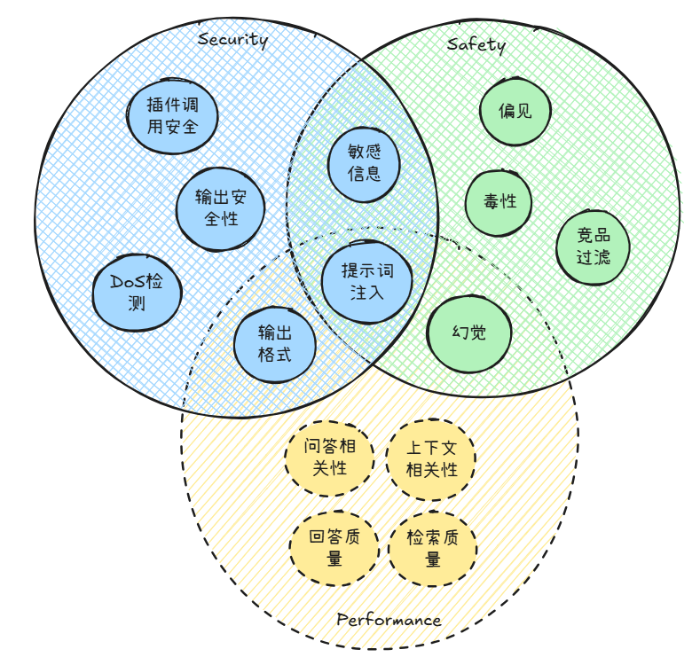
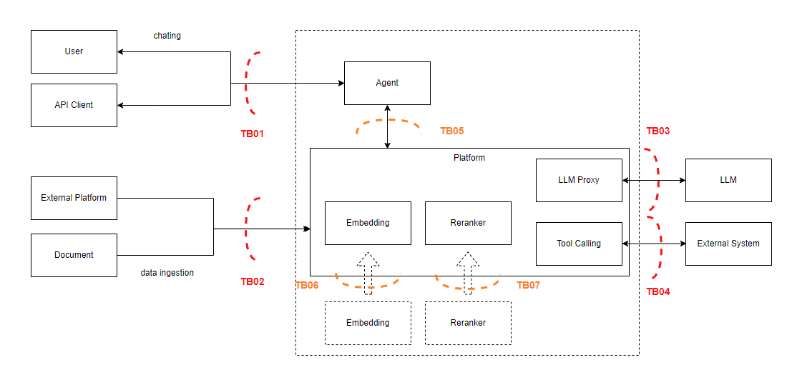
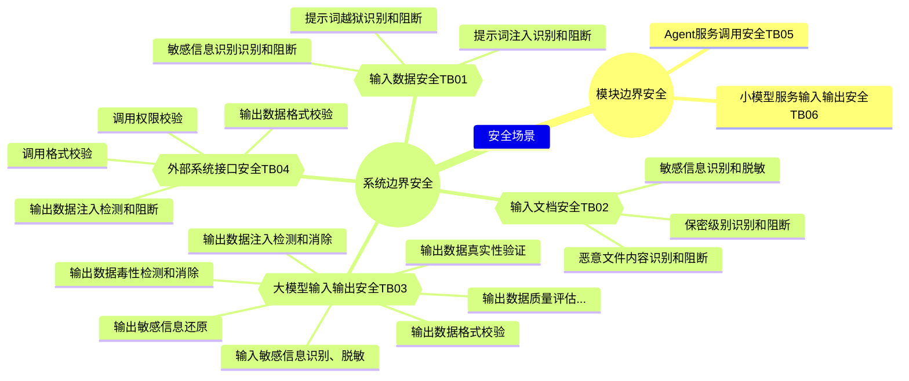

---
# You can also start simply with 'default'
theme: seriph
# random image from a curated Unsplash collection by Anthony
# like them? see https://unsplash.com/collections/94734566/slidev
background: https://cover.sli.dev
# some information about your slides (markdown enabled)
title: 大模型数据安全
info: |
  ## Slidev Starter Template
  Presentation slides for developers.

  Learn more at [Sli.dev](https://sli.dev)
# apply unocss classes to the current slide
class: text-center
# https://sli.dev/features/drawing
drawings:
  persist: false
# slide transition: https://sli.dev/guide/animations.html#slide-transitions
transition: slide-left
# enable MDC Syntax: https://sli.dev/features/mdc
mdc: true
# take snapshot for each slide in the overview
overviewSnapshots: true
setup:
  import { VueFlow } from '@vue-flow/core'
hideInToc: true
---

# 大模型数据安全

概念和设计

  <button @click="$slidev.nav.openInEditor()" title="Open in Editor" class="text-xl slidev-icon-btn opacity-50 !border-none !hover:text-white">
    <carbon:edit />
  </button>

<!--
The last comment block of each slide will be treated as slide notes. It will be visible and editable in Presenter Mode along with the slide. [Read more in the docs](https://sli.dev/guide/syntax.html#notes)
-->

---
hideInToc: true
---

# 目录
<Toc />

---
layout: two-cols-header
---

# 大模型平台的内生安全
Safety - Data Security - Performance

::left::

- Safety: 模型和系统输出内容是否合规
- Data Security: 模型和系统是否存在信息泄露风险
- Performance: 模型和系统的输出是否准确可控

::right::

---
layout: default
transition: view-transition
---

# 大模型平台数据安全场景
数据流分析

---
hideInToc: true
transition: view-transition
---

# 大模型平台数据安全场景
信任边界

- TB01: 客户端输入数据的安全验证和处理
- TB02: 文档进入知识库之前的安全验证和处理
- TB03: 系统到大模型服务的输入输出数据的安全验证和处理
- TB04: 系统调用外部接口和服务的安全验证和处理
- TB05: Agent调用平台服务的安全验证和处理，**等后续agent和平台充分解耦后再考虑**
- TB06: 小模型服务输入输出数据的安全验证和处理

---
layout: default
hideInToc: true
---

# 大模型平台数据安全场景

场景分析

---
layout: default
transition: view-transition
---

# 大模型平台数据安全技术
检测方式

- 静态规则：如正则表达式、关键词匹配
- 检测脚本/代码：基于先验知识的检测逻辑
- 传统模型检测：使用机器学习、针对下游任务的深度学习模型进行分类、打分、命名实体识别等
- 语言模型检测：使用通用大语言模型，微调语言模型，或者RAG系统对描述进行相对主观的分类和打分
- 存在性检测：使用API或探测逻辑对事实的存在性进行验证，如ip、域名、地址等

---
layout: default
transition: view-transition
hideInToc: true
---

# 大模型平台数据安全技术

| 应用场景           | 信任边界         | 场景分类    | 检测技术分类                | 检测技术                               |
| ------------------ | ---------------- | ----------- | --------------------------- | -------------------------------------- |
| 毒性检查           | TB03             | Safety      | 传统模型检测, 语言模型检测  | 传统模型分类，大模型分类               |
| 竞争对手识别       | TB03             | Safety      | 传统模型检测                | 实体识别                               |
| 敏感话题识别       | TB01             | Security    | 语言模型检测                | 大模型分类                             |
| 敏感信息识别       | TB01, TB02, TB03, TB06 | Security    | 传统模型检测                | 敏感信息检测                           |
| 隐私识别           | TB01, TB02, TB03, TB06 | Security    | 传统模型检测                | 实体识别                               |
| 偏见检查           | TB03             | Safety      | 语言模型检测                | 大模型分类                             |
| 数据库操作权限检查 | TB04             | Security    | 检测脚本/代码               | 语法解析                               |
| 数据库列权限检查   | TB04             | Security    | 检测脚本/代码               | 语法解析                               |
| 提示词异常检查     | TB01, TB02       | Security    | 语言模型检测                | 大模型分类                             |
| 提示词越狱检测     | TB01             | Security    | 语言模型检测                | 语义相似性，大模型检测                 |
| 注入检测           | TB01, TB02, TB03 | Security    | 检测脚本/代码               | xss检测                                |

--- 
hideInToc: true
---

# 大模型平台数据安全技术

| 应用场景           | 信任边界         | 场景分类    | 检测技术分类                | 检测技术                               |
| ------------------ | ---------------- | ----------- | --------------------------- | -------------------------------------- |
| RAG质量评估        | TB03, TB06       | Performance | 语言模型检测                | 大模型分类                             |
| 幻觉检测           | TB03             | Performance | 语言模型检测                | 大模型，RAG分类                        |
| 逻辑一致性评估     | TB03             | Performance | 语言模型检测                | 大模型分类                             |
| 冗余检查           | TB03             | Performance | 检测脚本/代码, 语言模型检测 | 模糊检索                               |
| 问答相关性检查     | TB03             | Performance | 语言模型检测, 静态规则      | 大模型分类                             |
| 语义相关性检查     | TB03             | Performance | 语言模型检测                | 语义相似性，大模型分类，RAG分类        |
| 摘要内容覆主题     | TB03             | Performance | 语言模型检测                | 大模型分类                             |
| 主题一致性         | TB03             | Performance | 语言模型检测                | 大模型分类                             |
| 输出格式检测       | TB03             | Security    | 静态规则，检测脚本/代码     | 静态，语法解析，反序列化检查（值检查） |
| 真实性检查         | TB03             | Safety      | 存在性检测                  | url可达性检查，地址真实性检查...       |

---
layout: two-cols-header
---

# 开源安全框架和技术

::left::

- 安全框架
  - [Guardrails AI](https://www.guardrailsai.com/)：覆盖类型广 <!-- validator覆盖场景较广，但是功能简单 -->
  - [LLMGuard](https://llm-guard.com/)：模型检测为主 <!-- 训练了很多[模型](https://huggingface.co/protectai)，用于特定的检测任务 -->
  - [PurpleLlama](https://github.com/meta-llama/PurpleLlama)<logos-meta-icon />
    - CodeShield：风险代码检查
    - Llama-Guard(1-3)：毒性检查模型
    - Prompt-Guard：恶意提示词检查
- 检测工具
  - 漏洞扫描
    - [garak](https://github.com/leondz/garak)
    - [Prompt Fuzzer](https://github.com/prompt-security/ps-fuzz)
    - [Plexiglass](https://github.com/safellama/plexiglass)
  - 注入检测
    - [rebuff](https://github.com/protectai/rebuff?tab=readme-ov-file)

::right::

- 安全模型
  - Llama-Guard(1-3)：毒性检查模型
    - 11B多模态
    - 1B，8B文本
  - Prompt-Guard：恶意提示词检查
    - 86M文本
- LLMOps平台
  - [Phoenix](https://docs.arize.com/phoenix)
  

<!-- Note: https://research.aimultiple.com/llm-security-tools/ -->

---
layout: center
class: text-center
---

# Learn More

[Documentation](https://sli.dev) · [GitHub](https://github.com/slidevjs/slidev) · [Showcases](https://sli.dev/resources/showcases)

<PoweredBySlidev mt-10 />

